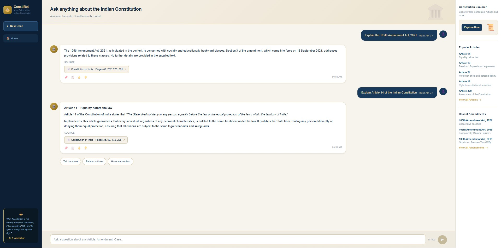

# 🏛️ ConstiBot — Indian Constitution AI Chatbot

> *"The Constitution is not merely a lawyers' document, it is a vehicle of Life, and its spirit is always the Spirit of Age."*
> — B. R. Ambedkar

**Built a production-ready AI chatbot that answers questions about the Indian Constitution accurately and with source citations, across 2,628 indexed chunks of constitutional text, by implementing a full RAG (Retrieval-Augmented Generation) pipeline using LangChain, ChromaDB, Groq, and Next.js — deployed live on Railway + Vercel.**

---

## 🌐 Live Demo

**Frontend:** https://constitution-chatbot-pruthviii23s-projects.vercel.app
**API:** https://web-production-66b29.up.railway.app

---

## 📸 Preview



---

## ✨ What It Does

- Answers any question about the Indian Constitution in natural language
- Cites the exact PDF pages the answer was drawn from
- Maintains conversational memory — handles follow-up questions like *"Can that right be suspended?"*
- Correctly refuses to answer things not in the Constitution (no hallucinations)
- Offers suggested follow-up questions, Popular Articles, and Recent Amendments as quick-access shortcuts

---

## 🧠 How It Works — RAG Architecture

Most LLMs can't reliably answer questions about a specific document — they either hallucinate or don't have it in their training data. RAG solves this by **retrieving relevant context at query time** and feeding it to the LLM.

```
                    ┌─────────────────── INGESTION (once) ────────────────────┐
                    │                                                          │
  constitution.pdf ──► PyPDFLoader ──► RecursiveCharacterTextSplitter ──► OllamaEmbeddings ──► ChromaDB
                    │   (402 pages)      (2,628 chunks, 500 chars each)    (nomic-embed-text)   (persisted)
                    └──────────────────────────────────────────────────────────┘

                    ┌─────────────────── QUERY (every message) ────────────────┐
                    │                                                           │
  User question ──► Embed query ──► ChromaDB similarity search ──► Top 4 chunks
                    │                    (MMR retrieval)                       │
                    │                                                           │
                    └──► LangChain prompt (question + chunks) ──► Groq LLM ──► Answer + Sources
```

**Key design decisions:**
- **MMR retrieval** (Maximal Marginal Relevance) fetches diverse chunks, not just the 4 most similar — avoids redundant context
- **History-aware retriever** rewrites follow-up questions into standalone queries before searching — so "Can that right be suspended?" becomes "Can the right to equality under Article 14 be suspended during an emergency?"
- **Session-based memory** via `RunnableWithMessageHistory` — each browser tab gets an isolated conversation
- **Batch ingestion** (50 chunks/batch) — prevents connection timeouts when embedding 2,600+ chunks locally

---

## 🛠️ Tech Stack

| Layer | Local (Dev) | Production |
|---|---|---|
| **LLM** | Ollama (`llama3.2`) | Groq (`openai/gpt-oss-20b`) |
| **Embeddings** | Ollama (`nomic-embed-text`) | Nomic API (`nomic-embed-text-v1`) |
| **Vector DB** | ChromaDB (local disk) | ChromaDB (committed to repo) |
| **RAG Framework** | LangChain + LangChain Classic | Same |
| **Backend** | FastAPI + Uvicorn | Railway |
| **Frontend** | Next.js 14 + Tailwind | Vercel |

---

## 📁 Project Structure

```
constitution-chatbot/
├── backend/
│   ├── ingest/
│   │   └── ingest.py          # PDF → chunks → embeddings → ChromaDB
│   ├── chain/
│   │   └── rag_chain.py       # LangChain RAG chain (retriever + LLM + memory)
│   ├── chroma_db/             # Persisted vector store (2,628 vectors)
│   ├── constitution.pdf       # Source document
│   └── main.py                # FastAPI app (POST /chat, DELETE /session)
├── frontend/
│   └── app/
│       └── page.tsx           # Next.js chat UI
├── requirements.txt
├── Procfile                   # Railway start command
└── .env                       # Local environment variables (not committed)
```

---

## 🚀 Run Locally

### Prerequisites
- Python 3.11+
- Node.js 18+
- [Ollama](https://ollama.com) installed and running

### 1. Clone and set up Python environment

```bash
git clone https://github.com/Pruthviii23/constitution_chatbot.git
cd constitution_chatbot
python -m venv venv
venv\Scripts\activate        # Windows
# source venv/bin/activate   # Mac/Linux
pip install -r requirements.txt
```

### 2. Pull Ollama models

```bash
ollama pull llama3.2
ollama pull nomic-embed-text
ollama serve                 # keep this running in a separate terminal
```

### 3. Configure environment

Create a `.env` file in the project root:

```env
OLLAMA_BASE_URL=http://localhost:11434
EMBED_MODEL=nomic-embed-text
LLM_MODEL=llama3.2
CHROMA_PATH=./backend/chroma_db
PDF_PATH=./backend/constitution.pdf
USE_GROQ=false
```

### 4. Ingest the PDF (skip if chroma_db already exists)

```bash
python backend/ingest/ingest.py
```

This takes 5–10 minutes — it embeds all 2,628 chunks locally.

### 5. Start the backend

```bash
uvicorn backend.main:app --reload --port 8000
```

### 6. Start the frontend

```bash
cd frontend
npm install
# create frontend/.env.local with:
# NEXT_PUBLIC_API_URL=http://localhost:8000
npm run dev
```

Open [http://localhost:3000](http://localhost:3000).

---

## 🔌 API Reference

### `POST /chat`

Send a question and get an answer with source pages.

**Request:**
```json
{
  "question": "What are the Fundamental Rights?",
  "session_id": "optional-existing-session-id"
}
```

**Response:**
```json
{
  "answer": "The Fundamental Rights are guaranteed under Part III...",
  "session_id": "a1b2c3d4-uuid",
  "sources": [34, 39, 40, 50]
}
```

### `DELETE /session/{session_id}`

Clears the conversation history for a session (called when user clicks "New Chat").

### `GET /health`

Returns `{"status": "ok"}` — used for Railway health checks.

---

## 🌍 Deploy Your Own

### Backend → Railway

1. Fork this repo
2. Connect to [Railway](https://railway.app) → New Project → Deploy from GitHub
3. Add environment variables in Railway dashboard:
   ```
   USE_GROQ=true
   GROQ_API_KEY=your_key         # console.groq.com
   NOMIC_API_KEY=your_key        # atlas.nomic.ai
   CHROMA_PATH=./backend/chroma_db
   OLLAMA_BASE_URL=http://localhost:11434
   ```
4. Set start command: `uvicorn backend.main:app --host 0.0.0.0 --port $PORT`

### Frontend → Vercel

1. New Project → Import repo → **set Root Directory to `frontend`**
2. Add environment variable: `NEXT_PUBLIC_API_URL=https://your-railway-url.up.railway.app`
3. Deploy

---

## 📚 Learning Outcomes

This project was built as a hands-on exploration of:

| Concept | What was learned |
|---|---|
| **RAG** | Why context retrieval beats fine-tuning for document-specific QA |
| **Vector embeddings** | How `nomic-embed-text` converts text to 768-dimension vectors for semantic search |
| **ChromaDB** | Persisting and querying a local vector store with MMR retrieval |
| **LangChain LCEL** | Composing chains: `create_history_aware_retriever` → `create_retrieval_chain` → `RunnableWithMessageHistory` |
| **FastAPI** | Building a production API with session management and CORS |
| **Next.js + Vercel** | Deploying a full-stack AI app with environment-based config |
| **Local → Cloud LLM swap** | Replacing Ollama with Groq for serverless production deployment |

---

## 🗺️ Roadmap

- [ ] Migrate memory from `RunnableWithMessageHistory` to **LangGraph** persistence
- [ ] Add **streaming** — answers appear word by word
- [ ] **Hybrid search** — combine semantic + keyword (BM25) retrieval for better amendment coverage
- [ ] Add article number extraction and deep-link citations
- [ ] Hindi language support

---

## 🤝 Contributing

Pull requests are welcome. For major changes, open an issue first.

---

## 📄 License

MIT — see [LICENSE](./LICENSE)

---

*Built with ❤️ and a deep respect for the Constitution of India.*